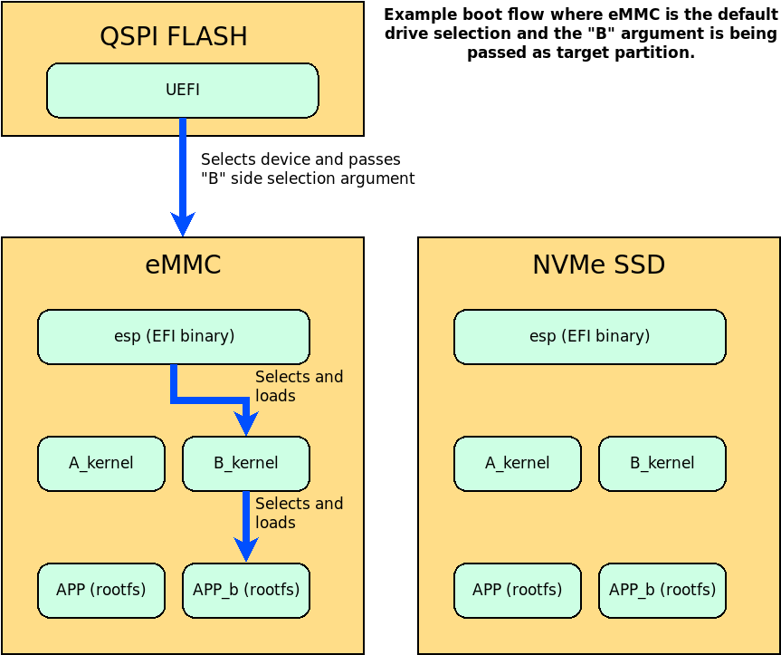
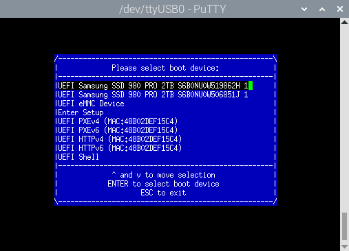

# NVMe provisioning

## Description

Both the GigCompute and GigRouter platforms support additional NVMe SSD storage options. The purpose is to provide both a redundant operating system boot option, and as storage for large amounts of user data. The script, cw-drive-setup.sh, is concerned with the former use case, partitioning a target drive and installing requisite components - bootloaders, rootfs, etc - to provision the drive as a boot option. After the process has completed the system can be configured to boot from either eMMC or NVMe options where eMMC will become the default fallback if the NVMe drive is damaged and undetectable.

## Boot Process

When power is applied to the system the nvidia SOM will execute internal boot code that expects to find a UEFI image programmed into internal flash memory. This UEFI image is compiled by cambrian-yocto, allowing for minor modifications, such as changing logging levels, and is programmed to the internal flash at the same time as programming the OS image onto eMMC (see Instructions). UEFI can detect storage devices - NVMe, SSD, PXE, USB etc - and will attempt to boot from each in order of priority until the system has successfully booted. Priority favours external devices first by default but can be adjusted.

For a device to be bootable it must host a fat32 formatted partition labeled "esp" containing an EFI boot binary. The EFI binary launches the next step of loading kernel and rootfs from the same device. If a serial console is connected to the system the boot process can be interrupted and the user can make a one time selection of the boot device manually through a menu selection. The same menu also allows for persistently changing boot device priority.



## Partitioning

GigRouter and GigCompute platforms support two layers of boot redundancy: the secondary storage hosts a complete copy of the system image so that if the secondary storage fails the system is still bootable from internal eMMC, and the partitioning within both devices provides duplicate copies of their partitions so that the system can be updated without putting it into recovery mode and reflashing. The latter approach is designated A/B.

Each storage device requires an esp partition (boot binary), a kernel partition, and a rootfs partition. The duplicate partitions are labeled with either a “\_B” suffix, or a “B_" prefix to distinguish them, resulting in this partition table:

| Number | Start  | End    | Size   | File system | Name               | Flags     |
| -------| ------ | ------ | ------ | ----------- | ------------------ | --------- |
| 1      | 1562MB | 31.1GB | 29.5GB | ext4        | APP                | msftdata  |
| 2      | 31.1GB | 60.6GB | 29.5GB | ext4        | APP_b              | msftdata  |
| 3      | 20.5kB | 134MB  | 134MB  |             | A_kernel           | msftdata  |
| 4      | 134MB  | 135MB  | 786kB  |             | A_kernel-dtb       | msftdata  |
| 5      | 135MB  | 168MB  | 33.2MB |             | A_reserved_on_user | msftdata  |
| 6      | 168MB  | 302MB  | 134MB  |             | B_kernel           | msftdata  |
| 7      | 302MB  | 303MB  | 786kB  |             | B_kernel-dtb       | msftdata  |
| 8      | 303MB  | 336MB  | 33.2MB |             | B_reserved_on_user | msftdata  |
| 9      | 336MB  | 420MB  | 83.9MB |             | recovery           | msftdata  |
| 10     | 420MB  | 421MB  | 524kB  |             | recovery-dtb       | msftdata  |
| 11     | 421MB  | 488MB  | 67.1MB | fat32       | esp                | boot, esp |
| 12     | 488MB  | 572MB  | 83.9MB |             | recovery_alt       | msftdata  |
| 13     | 572MB  | 572MB  | 524kB  |             | recovery-dtb_alt   | msftdata  |
| 14     | 572MB  | 639MB  | 67.1MB |             | esp_alt            | msftdata  |
| 15     | 639MB  | 1059MB | 419MB  |             | UDA                | msftdata  |
| 16     | 1059MB | 1562MB | 503MB  |             | reserved           | msftdata  |

## Provisioning Process

To facilitate installation of the Cambrian Yocto distribution on a GigRouter or GigCompute the image contains an executable script for provisioning a storage device as a bootable target.

### 1. Flash the Cambrian Yocto image to the internal eMMC device.

To begin, ensure that the current version of the Cambrian Yocto distribution is installed onto the system's internal eMMC device. Doing so provides a usable OS on the system which can be used to access and provision the secondary storage devices, as well as provide a redundant bootable fallback if the secondary storage fails sometime later during operation. Writing the image to eMMC requires the system be put into recovery mode. If an OS is already installed on the eMMC then recovery mode can be entered through a console command:

Alternatively, the nvidia Orin SOM provides two breakout pins - "recovery" and "reset" - which can be used to force recovery mode externally without the need for prerequisite software installed on the system. Please contact Cambrian Works for hardware support if this approach is preferred.

Once in recovery mode, and a USB flashing cable has connected the flashing host to the target Gig device, the target will be detected by the host computer. Executing `lsusb` will show the target enumerated as: `Bus 003 Device 003: ID 0955:7023 NVIDIA Corp. APX` (N.B., Bus and Device values will vary according to hub configuration).

Execute the `./doflash.sh` shell script provided in the Cambrian Yocto BSP tarball.

### 2. Boot into the image hosted on the eMMC.

If the Gig system has a blank NVMe SSD then after flashing it will boot into the image hosted on the eMMC storage automatically. However, if the NVMe SSD contains a valid, and bootable, image of a previous software version the NVMe SSD will be the boot device favoured by the UEFI bootloader. The UEFI bootloader will favour NVMe SSDs over the internal eMMC by default.

If the NVMe SSD contains a bootable image then the internal eMMC can be selected manually. Restart the Gig system with a UART console attached to the debug port (115200, 8, 1, None). The console will provide an opportunity to stop the boot process and select a boot device from a UEFI menu. To enter the menu press F11 when the console prompts:

```
  Jetson System firmware version v36.4.4 date 2024-10-01T15:28:28+00:00
ESC   to enter Setup.
F11   to enter Boot Manager Menu.
Enter to continue boot.
...
```



### 3. Provision the target drive.

When `./doflash.sh` was executed it created a signed and compressed image of the rootfs named cambrian-image.ext4.img. Transfer the image file to the target system: `scp cambrian-image.ext4.img gigrouter@<IP or hostname>:/tmp/`. From a console, either SSH session or UART, execute the provisioning script with the command: `sudo cw-provision-drive.sh -i /tmp/cambrian-image.ext4.img -d nvme1n1`. N.b., the target drive may be either **nvme0n1** or **nvme1n1** depending on which product configuration the target is. Please consult with Cambrian Works support for guidance on the specific model and hardware configuration.

During the provisioning process the target drive will be wiped and partitioned. The EFI boot binary will be written to the esp partition and cambrian-image.ext4.img will be extracted and written to both rootfs partitions (APP and APP_b).

Verify the partition table: `sudo parted /dev/nvme0n1 -s p` (or `/dev/nvme1n1`)